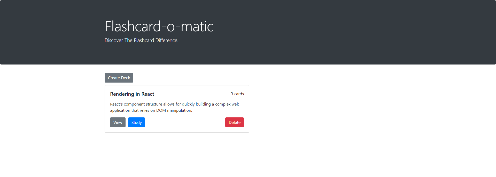

# Flash-Card-App

## Project Description:

*A local school has decided to put together a flash card application, Flashcard-o-matic, to help their students study online. Teachers will use this application to create decks of flash cards for the subjects that they teach, and students will study the decks. The school needs you to build the application that the students and teachers will use.*

## Objective:
This project is designed to test your ability to work with rendering and state management using React. 

- Installing packages via NPM

- Running tests from the command line

- Writing React function components

- Creating routes, including nested routes, using React Router

- Using hooks like useState(), useParams(), and useHistory()

- Debugging React code through console output and using the VS Code debugger

**This project uses dependencies which may inhibit running through the NPM Start Script, If this project is branched/cloned, you may need to ensure the package.json Start Script is as follows: "start": "react-scripts --openssl-legacy-provider start"**

**Additionally, running NPM Start will host both the API and React Application on your local machine.**

## Screen Shots:

### Home

### View Deck

### Edit Deck

### Create Deck

### Edit Card

### Add Card

### Study - Card Front

### Study - Card Back
